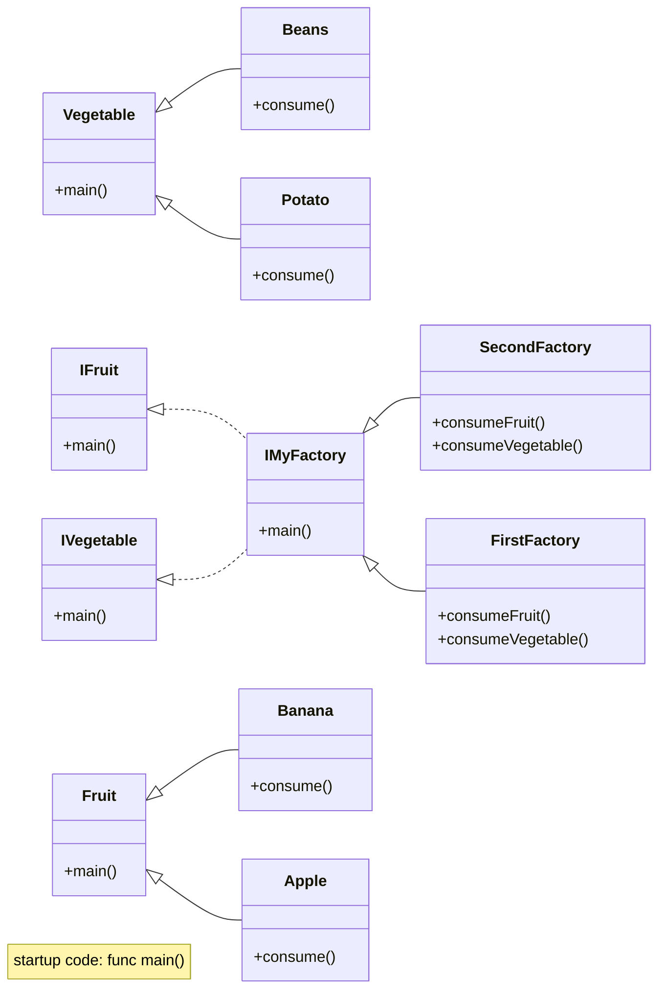

```mermaid
classDiagram
  direction LR
  class SecondFactory {
    +consumeFruit()
    +consumeVegetable()
  }

  class FirstFactory {
    +consumeFruit()
    +consumeVegetable()
  }

  class Beans {
    +consume()
  }

  class IVegetable {
    +main()
  }

  class Vegetable {
    +main()
  }

  class Banana {
    +consume()
  }

  class IMyFactory {
    +main()
  }

  class Potato {
    +consume()
  }

  class Apple {
    +consume()
  }

  class IFruit {
    +main()
  }

  class Fruit {
    +main()
  }

  IMyFactory <|-- SecondFactory
  IMyFactory <|-- FirstFactory
  Vegetable <|-- Beans
  Fruit <|-- Banana
  IFruit <|.. IMyFactory
  IVegetable <|.. IMyFactory
  Vegetable <|-- Potato
  Fruit <|-- Apple
  note "startup code: func main()"
```
