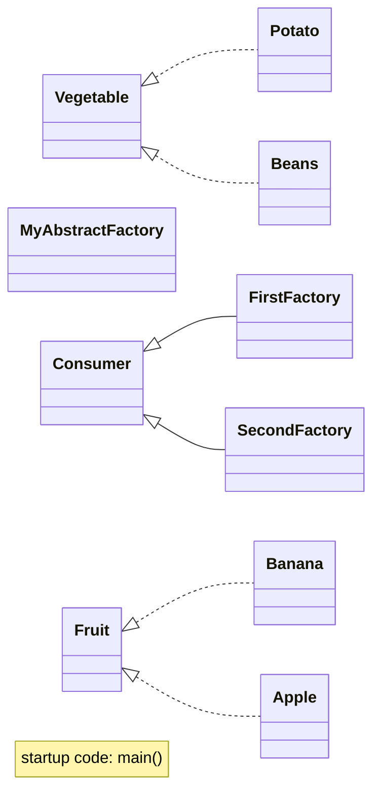

```mermaid
classDiagram
  direction LR
  class Vegetable {
  }

  class FirstFactory {
  }

  class MyAbstractFactory {
  }

  class Potato {
  }

  class Beans {
  }

  class Consumer {
  }

  class Banana {
  }

  class SecondFactory {
  }

  class Fruit {
  }

  class Apple {
  }

  Consumer <|-- FirstFactory
  Vegetable <|.. Potato
  Vegetable <|.. Beans
  Fruit <|.. Banana
  Consumer <|-- SecondFactory
  Fruit <|.. Apple
  note "startup code: main()"
```
