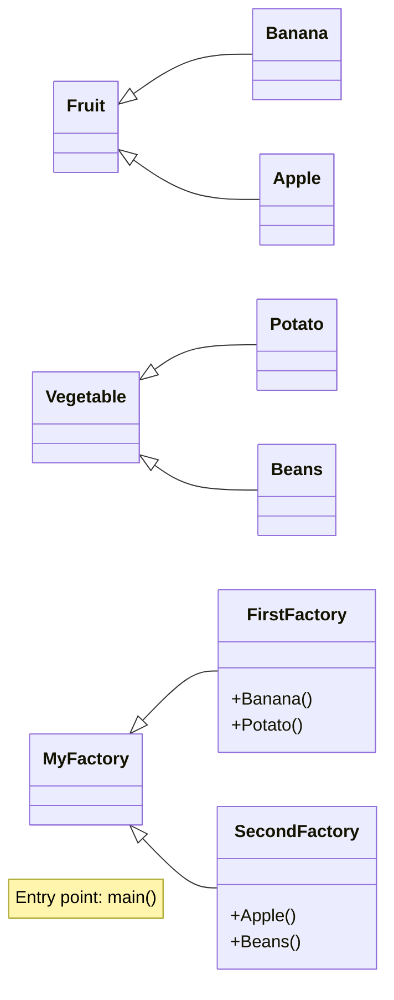

```mermaid
classDiagram
  direction LR

  class Fruit

  class Banana

  class Apple

  class Vegetable

  class Potato

  class Beans

  class MyFactory

  class FirstFactory {
    +Banana()
    +Potato()
  }

  class SecondFactory {
    +Apple()
    +Beans()
  }

  Fruit <|-- Banana

  Fruit <|-- Apple

  Vegetable <|-- Potato

  Vegetable <|-- Beans

  MyFactory <|-- FirstFactory

  MyFactory <|-- SecondFactory

  note "Entry point: main()"
```
