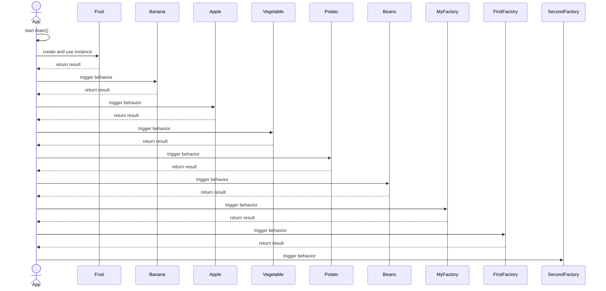

```mermaid
sequenceDiagram
  actor App
  participant Fruit
  participant Banana
  participant Apple
  participant Vegetable
  participant Potato
  participant Beans
  participant MyFactory
  participant FirstFactory
  participant SecondFactory
  App->>App: start main()
  App->>Fruit: create and use instance
  Fruit-->>App: return result
  App->>Banana: trigger behavior
  Banana-->>App: return result
  App->>Apple: trigger behavior
  Apple-->>App: return result
  App->>Vegetable: trigger behavior
  Vegetable-->>App: return result
  App->>Potato: trigger behavior
  Potato-->>App: return result
  App->>Beans: trigger behavior
  Beans-->>App: return result
  App->>MyFactory: trigger behavior
  MyFactory-->>App: return result
  App->>FirstFactory: trigger behavior
  FirstFactory-->>App: return result
  App->>SecondFactory: trigger behavior
```
