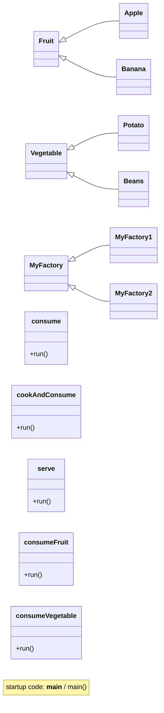

```mermaid
classDiagram
  direction LR
  class Fruit {
  }
  class Apple {
  }
  class Banana {
  }
  class Vegetable {
  }
  class Potato {
  }
  class Beans {
  }
  class MyFactory {
  }
  class MyFactory1 {
  }
  class MyFactory2 {
  }
  class consume {
    +run()
  }
  class cookAndConsume {
    +run()
  }
  class serve {
    +run()
  }
  class consumeFruit {
    +run()
  }
  class consumeVegetable {
    +run()
  }
  Fruit <|-- Apple
  Fruit <|-- Banana
  Vegetable <|-- Potato
  Vegetable <|-- Beans
  MyFactory <|-- MyFactory1
  MyFactory <|-- MyFactory2
  note "startup code: __main__ / main()"
```
