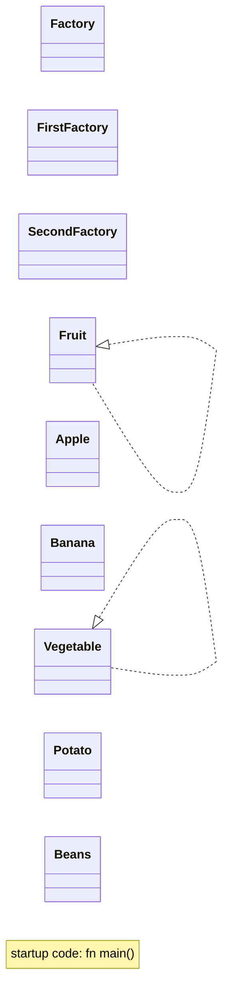

```mermaid
classDiagram
  direction LR
  class Factory {
  }

  class FirstFactory {
  }

  class SecondFactory {
  }

  class Fruit {
  }

  class Apple {
  }

  class Banana {
  }

  class Vegetable {
  }

  class Potato {
  }

  class Beans {
  }

  Fruit <|.. Fruit
  Vegetable <|.. Vegetable
  note "startup code: fn main()"
```
