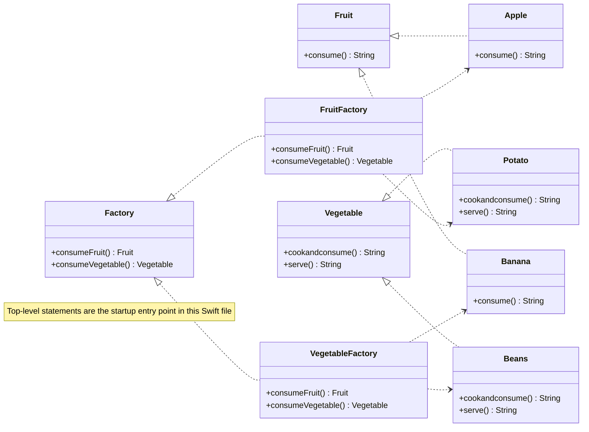

```mermaid
classDiagram
  direction LR

  class Fruit {
    +consume() String
  }

  class Apple {
    +consume() String
  }

  class Banana {
    +consume() String
  }

  class Vegetable {
    +cookandconsume() String
    +serve() String
  }

  class Potato {
    +cookandconsume() String
    +serve() String
  }

  class Beans {
    +cookandconsume() String
    +serve() String
  }

  class Factory {
    +consumeFruit() Fruit
    +consumeVegetable() Vegetable
  }

  class FruitFactory {
    +consumeFruit() Fruit
    +consumeVegetable() Vegetable
  }

  class VegetableFactory {
    +consumeFruit() Fruit
    +consumeVegetable() Vegetable
  }

  Fruit <|.. Apple
  Fruit <|.. Banana
  Vegetable <|.. Potato
  Vegetable <|.. Beans

  Factory <|.. FruitFactory
  Factory <|.. VegetableFactory

  FruitFactory ..> Apple
  FruitFactory ..> Potato
  VegetableFactory ..> Banana
  VegetableFactory ..> Beans

  note "Top-level statements are the startup entry point in this Swift file"
```
