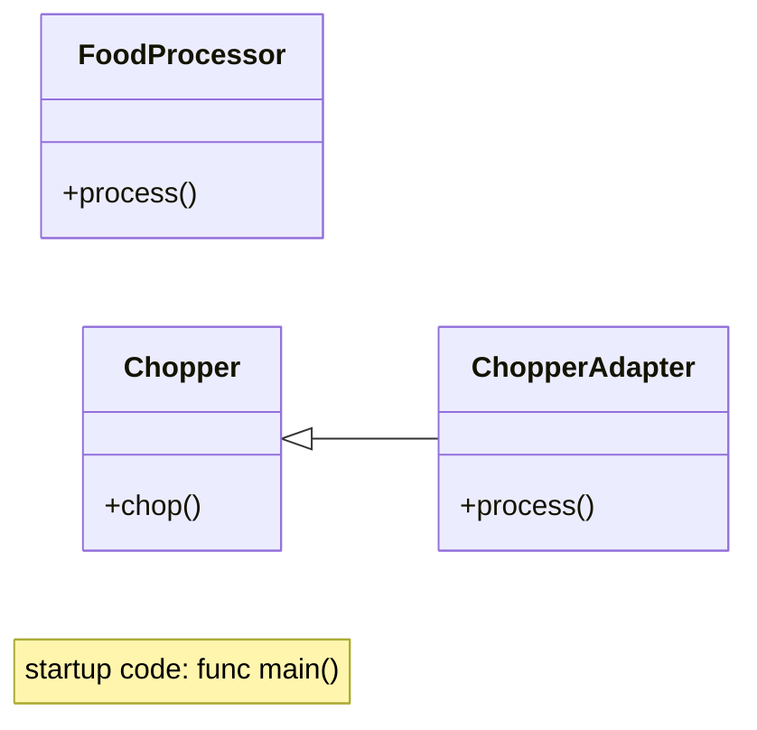

```mermaid
classDiagram
  direction LR
  class FoodProcessor {
    +process()
  }

  class ChopperAdapter {
    +process()
  }

  class Chopper {
    +chop()
  }

  Chopper <|-- ChopperAdapter
  note "startup code: func main()"
```
