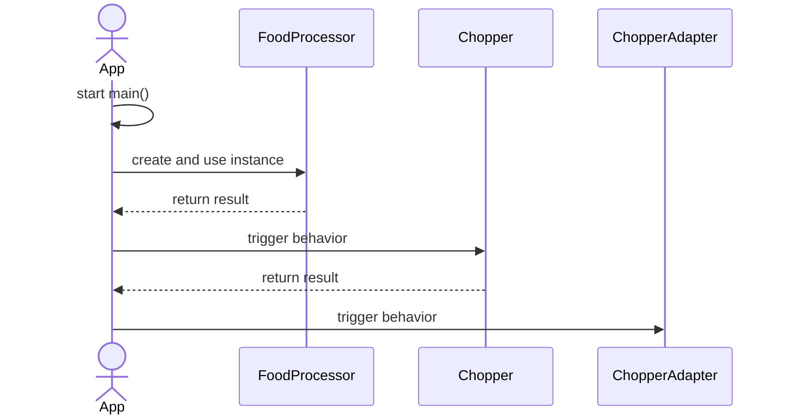

```mermaid
sequenceDiagram
  actor App
  participant FoodProcessor
  participant Chopper
  participant ChopperAdapter
  App->>App: start main()
  App->>FoodProcessor: create and use instance
  FoodProcessor-->>App: return result
  App->>Chopper: trigger behavior
  Chopper-->>App: return result
  App->>ChopperAdapter: trigger behavior
```
