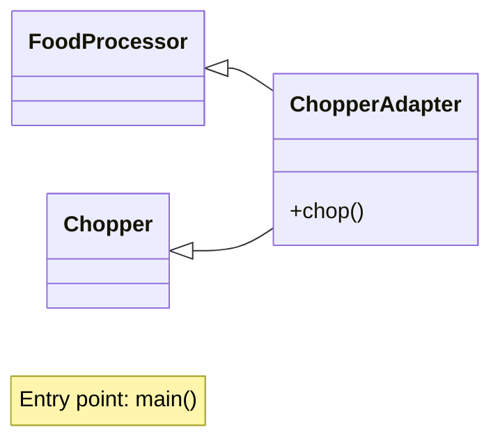

```mermaid
classDiagram
  direction LR

  class FoodProcessor

  class Chopper

  class ChopperAdapter {
    +chop()
  }

  FoodProcessor <|-- ChopperAdapter
  Chopper <|-- ChopperAdapter

  note "Entry point: main()"
```
