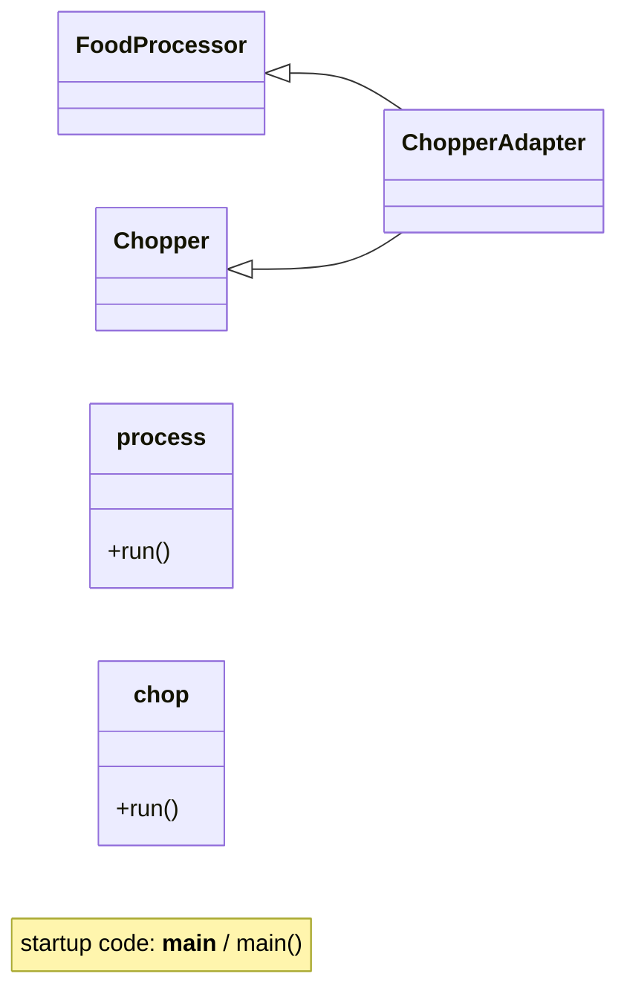

```mermaid
classDiagram
  direction LR
  class FoodProcessor {
  }
  class Chopper {
  }
  class ChopperAdapter {
  }
  class process {
    +run()
  }
  class chop {
    +run()
  }
  FoodProcessor <|-- ChopperAdapter
  Chopper <|-- ChopperAdapter
  note "startup code: __main__ / main()"
```
