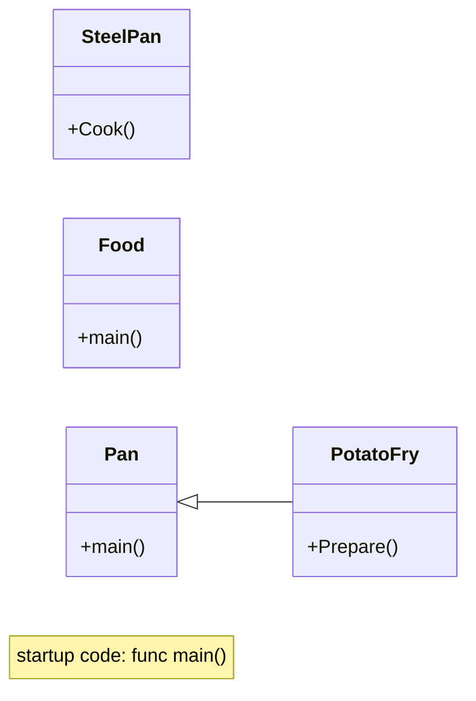

```mermaid
classDiagram
  direction LR
  class PotatoFry {
    +Prepare()
  }

  class SteelPan {
    +Cook()
  }

  class Food {
    +main()
  }

  class Pan {
    +main()
  }

  Pan <|-- PotatoFry
  note "startup code: func main()"
```
