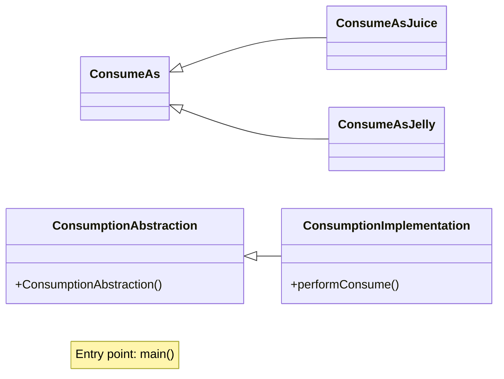

```mermaid
classDiagram
  direction LR

  class ConsumeAs

  class ConsumeAsJuice

  class ConsumeAsJelly

  class ConsumptionAbstraction {
    +ConsumptionAbstraction()
  }

  class ConsumptionImplementation {
    +performConsume()
  }

  ConsumeAs <|-- ConsumeAsJuice

  ConsumeAs <|-- ConsumeAsJelly

  ConsumptionAbstraction <|-- ConsumptionImplementation

  note "Entry point: main()"
```
