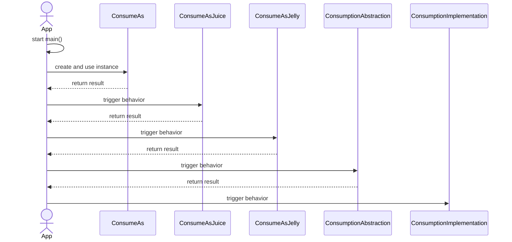

```mermaid
sequenceDiagram
  actor App
  participant ConsumeAs
  participant ConsumeAsJuice
  participant ConsumeAsJelly
  participant ConsumptionAbstraction
  participant ConsumptionImplementation
  App->>App: start main()
  App->>ConsumeAs: create and use instance
  ConsumeAs-->>App: return result
  App->>ConsumeAsJuice: trigger behavior
  ConsumeAsJuice-->>App: return result
  App->>ConsumeAsJelly: trigger behavior
  ConsumeAsJelly-->>App: return result
  App->>ConsumptionAbstraction: trigger behavior
  ConsumptionAbstraction-->>App: return result
  App->>ConsumptionImplementation: trigger behavior
```
