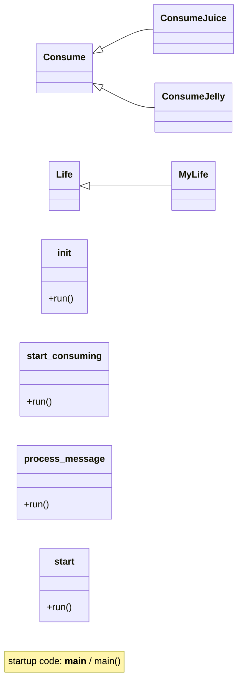

```mermaid
classDiagram
  direction LR
  class Consume {
  }
  class ConsumeJuice {
  }
  class ConsumeJelly {
  }
  class Life {
  }
  class MyLife {
  }
  class __init__ {
    +run()
  }
  class start_consuming {
    +run()
  }
  class process_message {
    +run()
  }
  class start {
    +run()
  }
  Consume <|-- ConsumeJuice
  Consume <|-- ConsumeJelly
  Life <|-- MyLife
  note "startup code: __main__ / main()"
```
