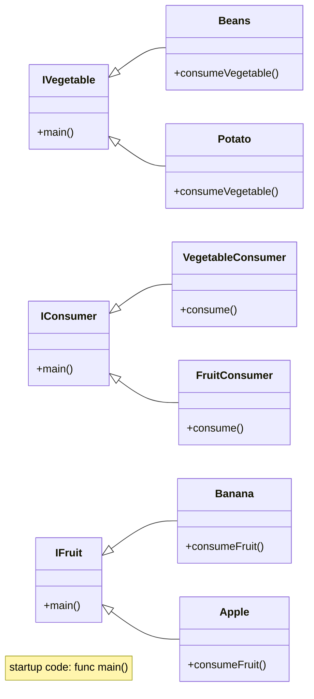

```mermaid
classDiagram
  direction LR
  class Beans {
    +consumeVegetable()
  }

  class VegetableConsumer {
    +consume()
  }

  class IVegetable {
    +main()
  }

  class FruitConsumer {
    +consume()
  }

  class Banana {
    +consumeFruit()
  }

  class IConsumer {
    +main()
  }

  class Potato {
    +consumeVegetable()
  }

  class Apple {
    +consumeFruit()
  }

  class IFruit {
    +main()
  }

  IVegetable <|-- Beans
  IConsumer <|-- VegetableConsumer
  IConsumer <|-- FruitConsumer
  IFruit <|-- Banana
  IVegetable <|-- Potato
  IFruit <|-- Apple
  note "startup code: func main()"
```
