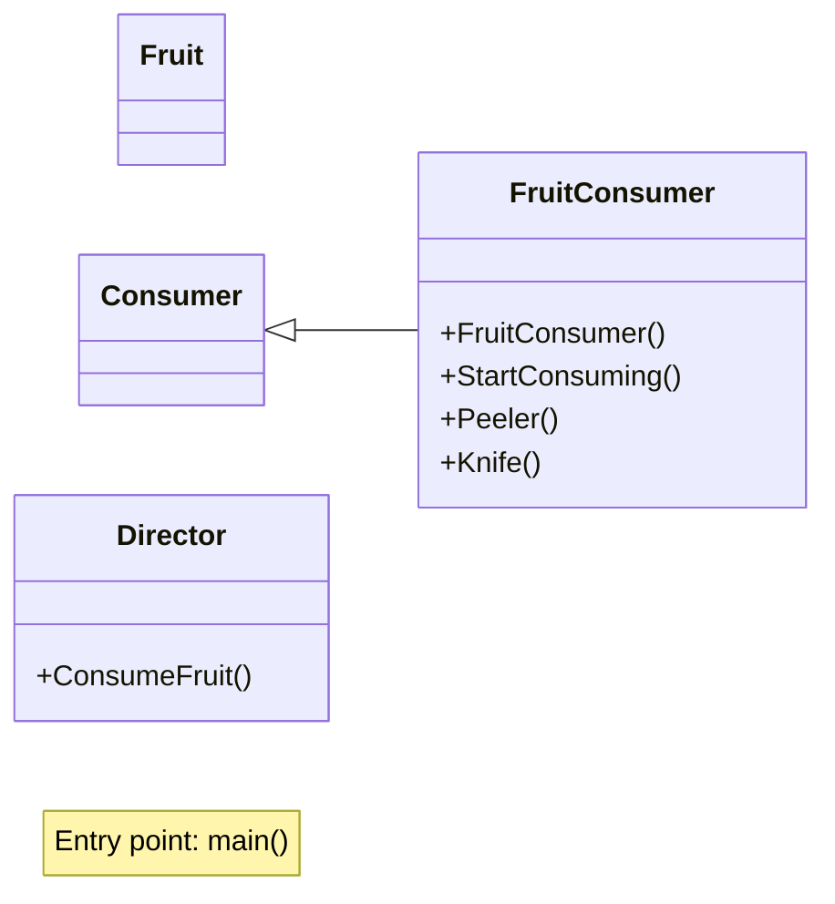

```mermaid
classDiagram
  direction LR

  class Fruit

  class Consumer

  class FruitConsumer {
    +FruitConsumer()
    +StartConsuming()
    +Peeler()
    +Knife()
  }

  class Director {
    +ConsumeFruit()
  }

  Consumer <|-- FruitConsumer

  note "Entry point: main()"
```
