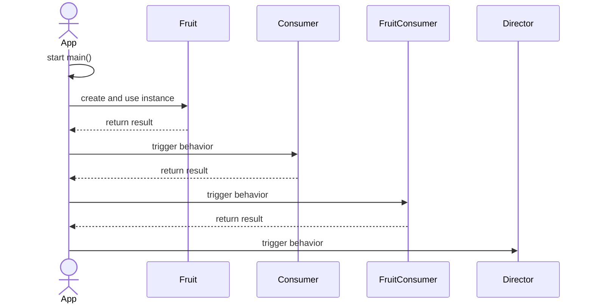

```mermaid
sequenceDiagram
  actor App
  participant Fruit
  participant Consumer
  participant FruitConsumer
  participant Director
  App->>App: start main()
  App->>Fruit: create and use instance
  Fruit-->>App: return result
  App->>Consumer: trigger behavior
  Consumer-->>App: return result
  App->>FruitConsumer: trigger behavior
  FruitConsumer-->>App: return result
  App->>Director: trigger behavior
```
