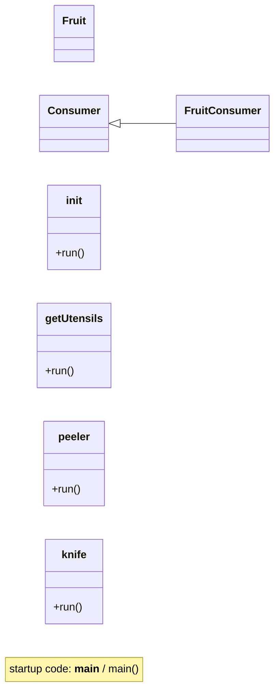

```mermaid
classDiagram
  direction LR
  class Fruit {
  }
  class Consumer {
  }
  class FruitConsumer {
  }
  class __init__ {
    +run()
  }
  class getUtensils {
    +run()
  }
  class peeler {
    +run()
  }
  class knife {
    +run()
  }
  Consumer <|-- FruitConsumer
  note "startup code: __main__ / main()"
```
