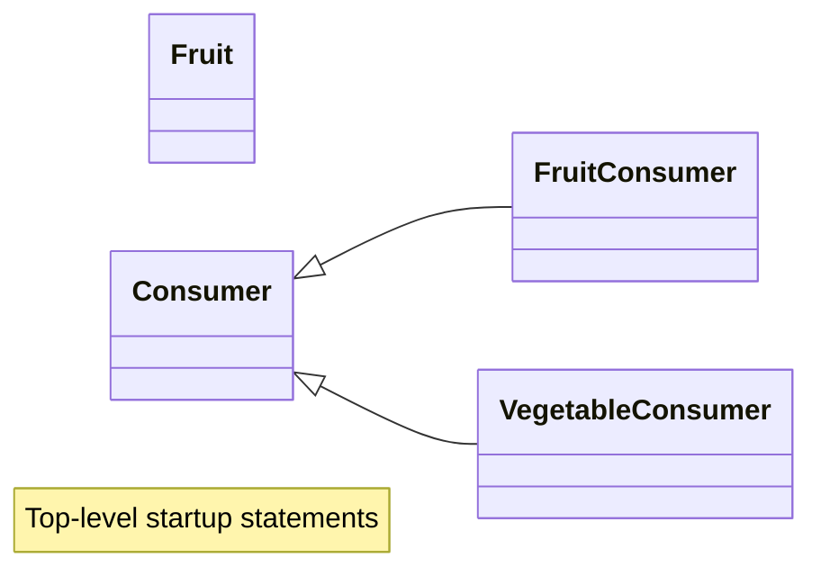

```mermaid
classDiagram
  direction LR
  class Fruit {
  }
  class Consumer {
  }
  class FruitConsumer {
  }
  class VegetableConsumer {
  }
  Consumer <|-- FruitConsumer
  Consumer <|-- VegetableConsumer
  note "Top-level startup statements"
```
