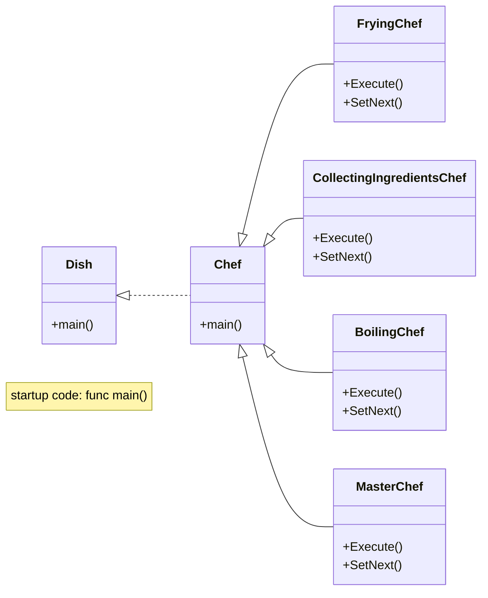

```mermaid
classDiagram
  direction LR
  class FryingChef {
    +Execute()
    +SetNext()
  }

  class CollectingIngredientsChef {
    +Execute()
    +SetNext()
  }

  class BoilingChef {
    +Execute()
    +SetNext()
  }

  class Chef {
    +main()
  }

  class Dish {
    +main()
  }

  class MasterChef {
    +Execute()
    +SetNext()
  }

  Chef <|-- FryingChef
  Chef <|-- CollectingIngredientsChef
  Chef <|-- BoilingChef
  Dish <|.. Chef
  Chef <|-- MasterChef
  note "startup code: func main()"
```
