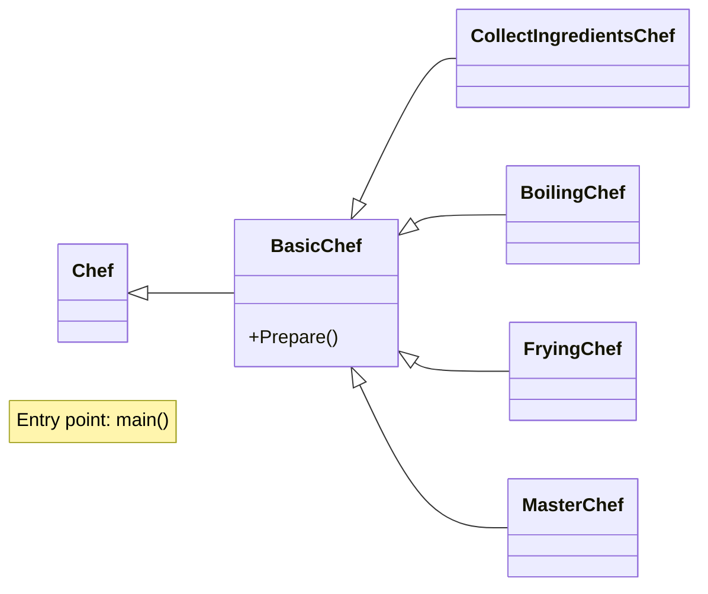

```mermaid
classDiagram
  direction LR

  class Chef

  class BasicChef {
    +Prepare()
  }

  class CollectIngredientsChef

  class BoilingChef

  class FryingChef

  class MasterChef

  Chef <|-- BasicChef

  BasicChef <|-- CollectIngredientsChef

  BasicChef <|-- BoilingChef

  BasicChef <|-- FryingChef

  BasicChef <|-- MasterChef

  note "Entry point: main()"
```
