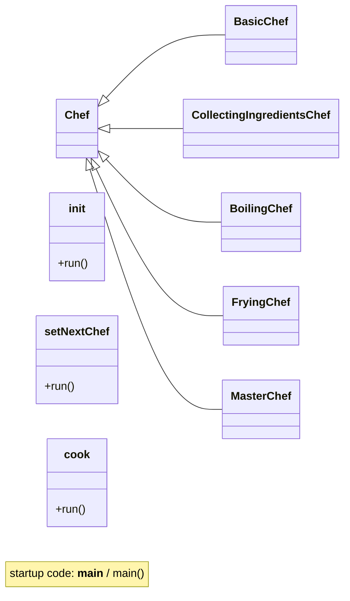

```mermaid
classDiagram
  direction LR
  class Chef {
  }
  class BasicChef {
  }
  class CollectingIngredientsChef {
  }
  class BoilingChef {
  }
  class FryingChef {
  }
  class MasterChef {
  }
  class __init__ {
    +run()
  }
  class setNextChef {
    +run()
  }
  class cook {
    +run()
  }
  Chef <|-- BasicChef
  Chef <|-- CollectingIngredientsChef
  Chef <|-- BoilingChef
  Chef <|-- FryingChef
  Chef <|-- MasterChef
  note "startup code: __main__ / main()"
```
