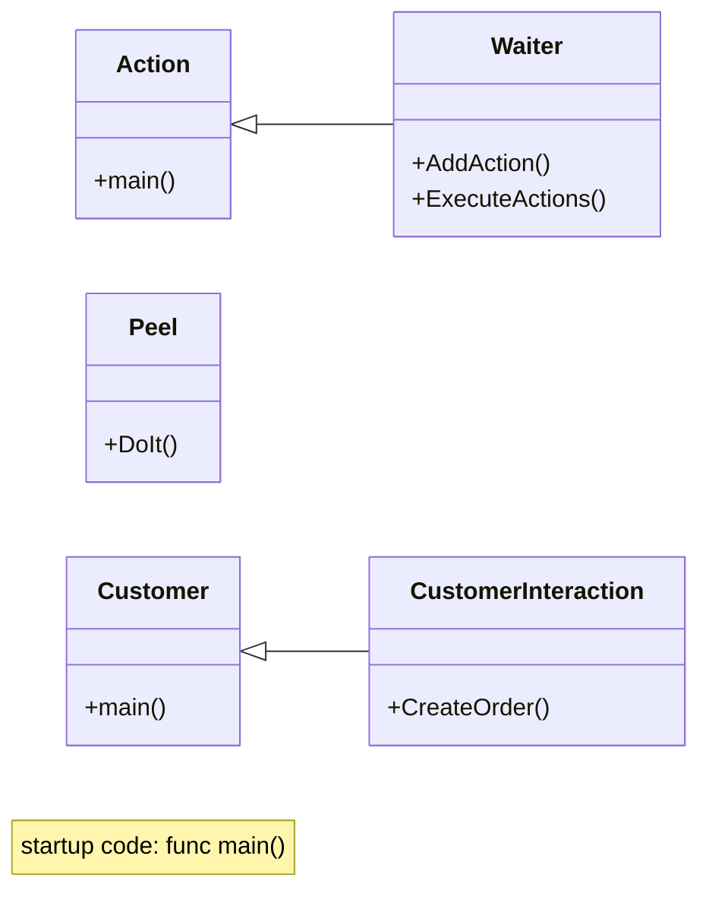

```mermaid
classDiagram
  direction LR
  class Action {
    +main()
  }

  class Waiter {
    +AddAction()
    +ExecuteActions()
  }

  class Peel {
    +DoIt()
  }

  class CustomerInteraction {
    +CreateOrder()
  }

  class Customer {
    +main()
  }

  Action <|-- Waiter
  Customer <|-- CustomerInteraction
  note "startup code: func main()"
```
