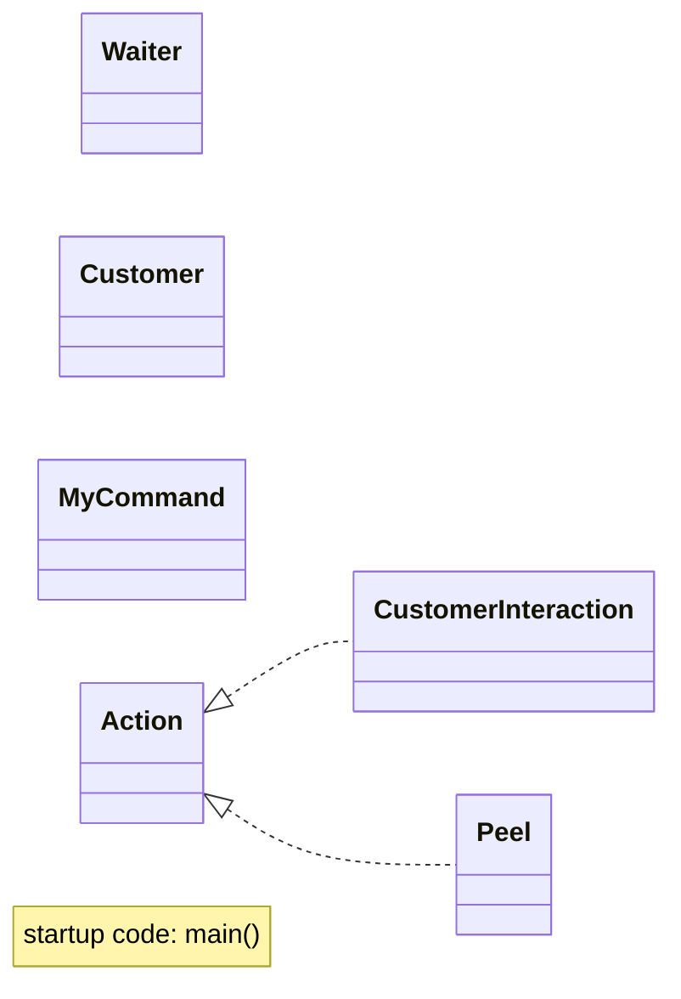

```mermaid
classDiagram
  direction LR
  class Waiter {
  }

  class Customer {
  }

  class CustomerInteraction {
  }

  class MyCommand {
  }

  class Action {
  }

  class Peel {
  }

  Action <|.. CustomerInteraction
  Action <|.. Peel
  note "startup code: main()"
```
