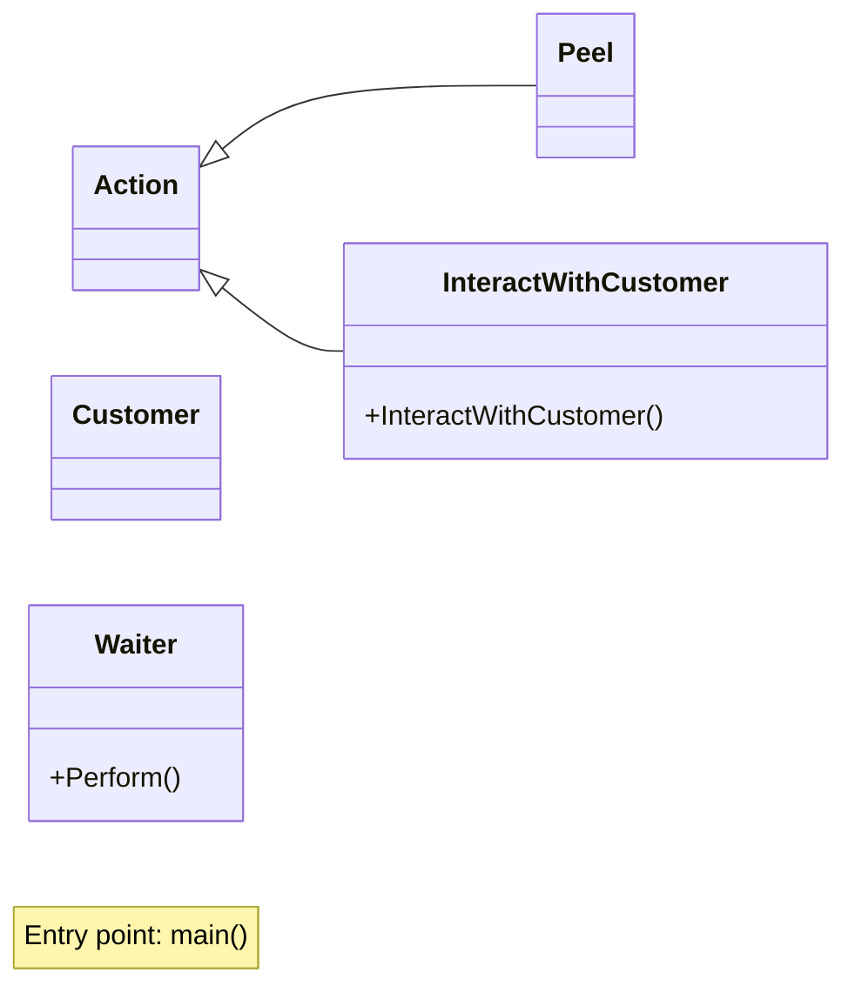

```mermaid
classDiagram
  direction LR

  class Action

  class Peel

  class Customer

  class InteractWithCustomer {
    +InteractWithCustomer()
  }

  class Waiter {
    +Perform()
  }

  Action <|-- Peel

  Action <|-- InteractWithCustomer

  note "Entry point: main()"
```
