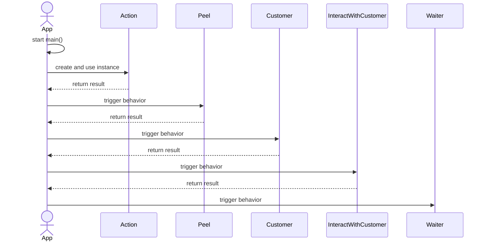

```mermaid
sequenceDiagram
  actor App
  participant Action
  participant Peel
  participant Customer
  participant InteractWithCustomer
  participant Waiter
  App->>App: start main()
  App->>Action: create and use instance
  Action-->>App: return result
  App->>Peel: trigger behavior
  Peel-->>App: return result
  App->>Customer: trigger behavior
  Customer-->>App: return result
  App->>InteractWithCustomer: trigger behavior
  InteractWithCustomer-->>App: return result
  App->>Waiter: trigger behavior
```
