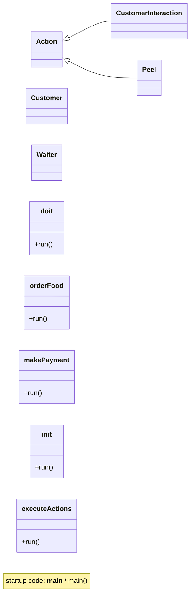

```mermaid
classDiagram
  direction LR
  class Action {
  }
  class Customer {
  }
  class CustomerInteraction {
  }
  class Peel {
  }
  class Waiter {
  }
  class doit {
    +run()
  }
  class orderFood {
    +run()
  }
  class makePayment {
    +run()
  }
  class __init__ {
    +run()
  }
  class executeActions {
    +run()
  }
  Action <|-- CustomerInteraction
  Action <|-- Peel
  note "startup code: __main__ / main()"
```
