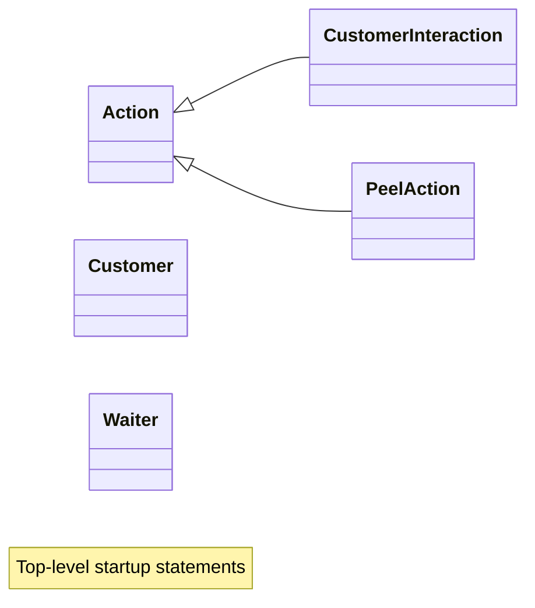

```mermaid
classDiagram
  direction LR
  class Action {
  }
  class Customer {
  }
  class CustomerInteraction {
  }
  class PeelAction {
  }
  class Waiter {
  }
  Action <|-- CustomerInteraction
  Action <|-- PeelAction
  note "Top-level startup statements"
```
