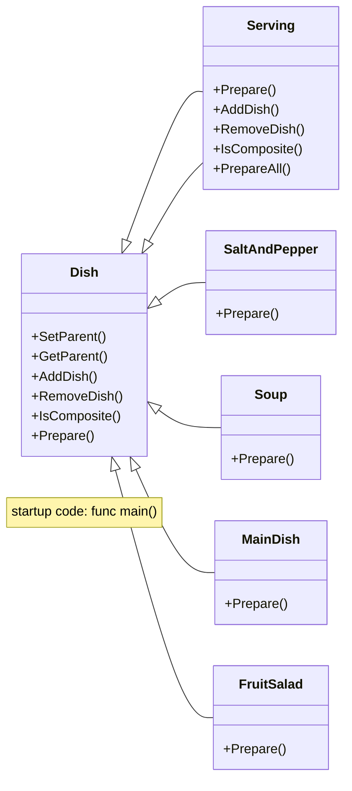

```mermaid
classDiagram
  direction LR
  class Serving {
    +Prepare()
    +AddDish()
    +RemoveDish()
    +IsComposite()
    +PrepareAll()
  }

  class SaltAndPepper {
    +Prepare()
  }

  class Soup {
    +Prepare()
  }

  class MainDish {
    +Prepare()
  }

  class FruitSalad {
    +Prepare()
  }

  class Dish {
    +SetParent()
    +GetParent()
    +AddDish()
    +RemoveDish()
    +IsComposite()
    +Prepare()
  }

  Dish <|-- Serving
  Dish <|-- Serving
  Dish <|-- SaltAndPepper
  Dish <|-- Soup
  Dish <|-- MainDish
  Dish <|-- FruitSalad
  note "startup code: func main()"
```
