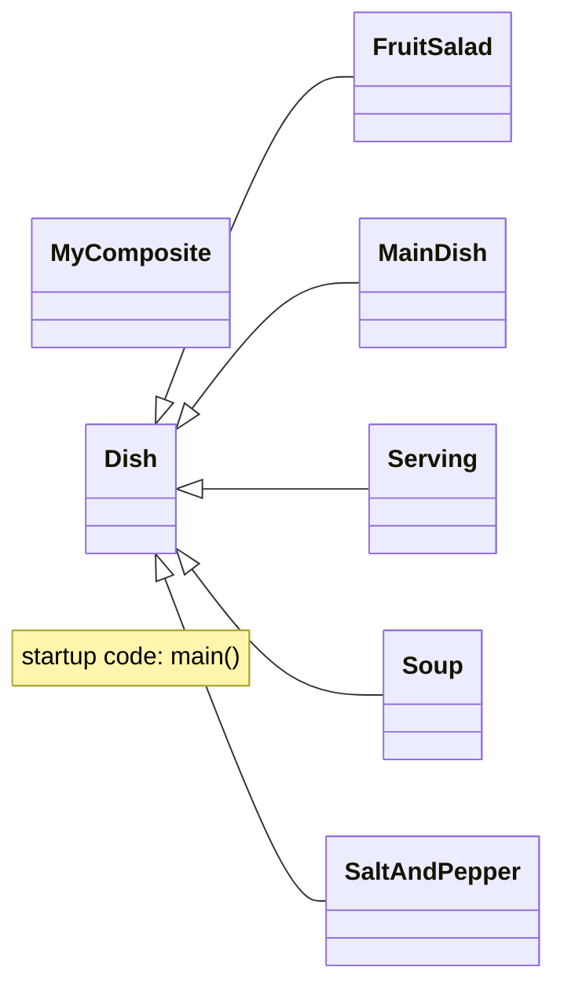

```mermaid
classDiagram
  direction LR
  class FruitSalad {
  }

  class MainDish {
  }

  class MyComposite {
  }

  class Serving {
  }

  class Dish {
  }

  class Soup {
  }

  class SaltAndPepper {
  }

  Dish <|-- FruitSalad
  Dish <|-- MainDish
  Dish <|-- Serving
  Dish <|-- Soup
  Dish <|-- SaltAndPepper
  note "startup code: main()"
```
