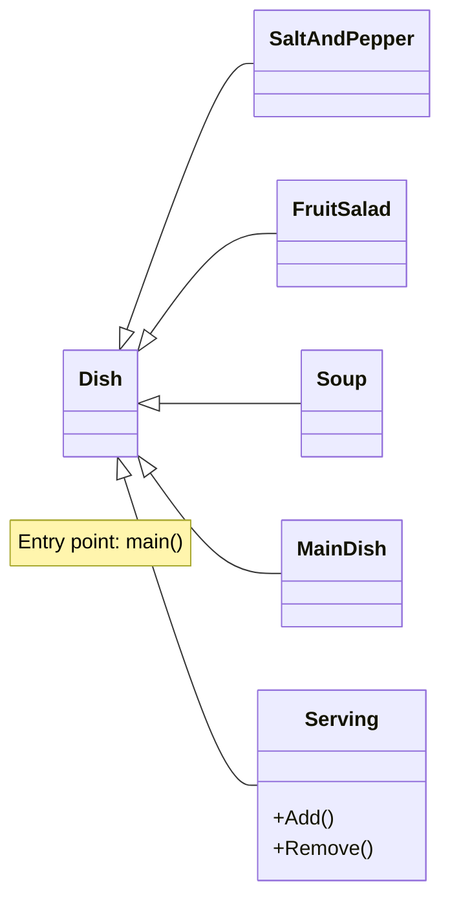

```mermaid
classDiagram
  direction LR

  class Dish

  class SaltAndPepper

  class FruitSalad

  class Soup

  class MainDish

  class Serving {
    +Add()
    +Remove()
  }

  Dish <|-- SaltAndPepper

  Dish <|-- FruitSalad

  Dish <|-- Soup

  Dish <|-- MainDish

  Dish <|-- Serving

  note "Entry point: main()"
```
