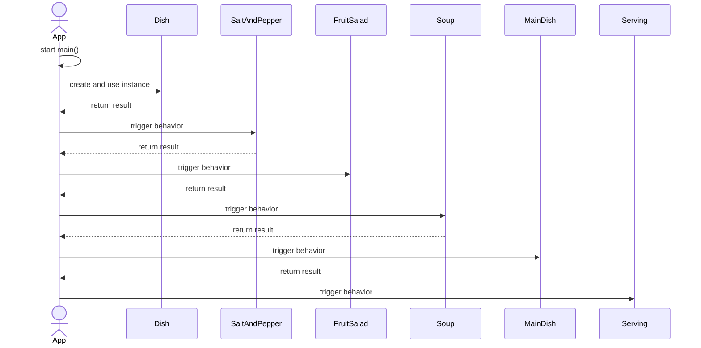

```mermaid
sequenceDiagram
  actor App
  participant Dish
  participant SaltAndPepper
  participant FruitSalad
  participant Soup
  participant MainDish
  participant Serving
  App->>App: start main()
  App->>Dish: create and use instance
  Dish-->>App: return result
  App->>SaltAndPepper: trigger behavior
  SaltAndPepper-->>App: return result
  App->>FruitSalad: trigger behavior
  FruitSalad-->>App: return result
  App->>Soup: trigger behavior
  Soup-->>App: return result
  App->>MainDish: trigger behavior
  MainDish-->>App: return result
  App->>Serving: trigger behavior
```
