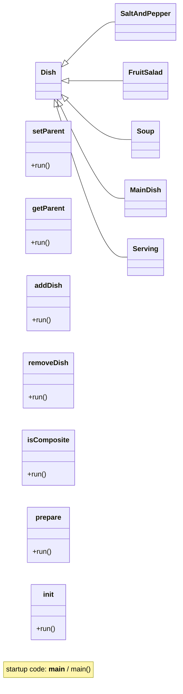

```mermaid
classDiagram
  direction LR
  class Dish {
  }
  class SaltAndPepper {
  }
  class FruitSalad {
  }
  class Soup {
  }
  class MainDish {
  }
  class Serving {
  }
  class setParent {
    +run()
  }
  class getParent {
    +run()
  }
  class addDish {
    +run()
  }
  class removeDish {
    +run()
  }
  class isComposite {
    +run()
  }
  class prepare {
    +run()
  }
  class __init__ {
    +run()
  }
  Dish <|-- SaltAndPepper
  Dish <|-- FruitSalad
  Dish <|-- Soup
  Dish <|-- MainDish
  Dish <|-- Serving
  note "startup code: __main__ / main()"
```
