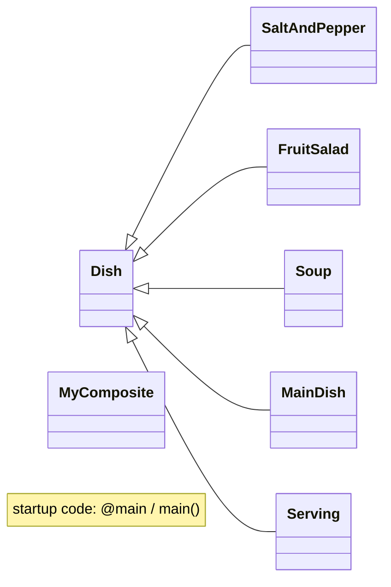

```mermaid
classDiagram
  direction LR
  class Dish {
  }
  class SaltAndPepper {
  }
  class FruitSalad {
  }
  class Soup {
  }
  class MainDish {
  }
  class Serving {
  }
  class MyComposite {
  }
  Dish <|-- SaltAndPepper
  Dish <|-- FruitSalad
  Dish <|-- Soup
  Dish <|-- MainDish
  Dish <|-- Serving
  note "startup code: @main / main()"
```
