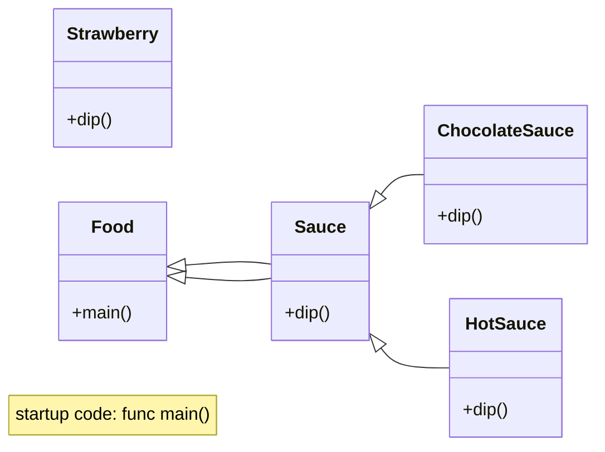

```mermaid
classDiagram
  direction LR
  class Strawberry {
    +dip()
  }

  class Sauce {
    +dip()
  }

  class ChocolateSauce {
    +dip()
  }

  class Food {
    +main()
  }

  class HotSauce {
    +dip()
  }

  Food <|-- Sauce
  Food <|-- Sauce
  Sauce <|-- ChocolateSauce
  Sauce <|-- HotSauce
  note "startup code: func main()"
```
