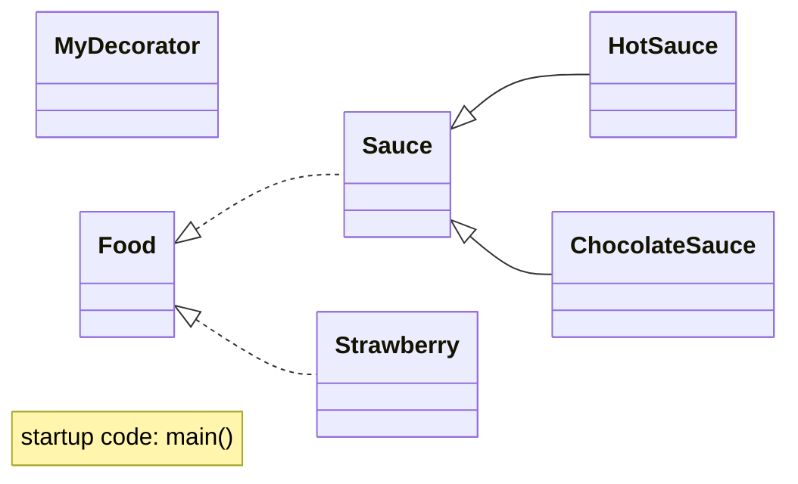

```mermaid
classDiagram
  direction LR
  class HotSauce {
  }

  class Sauce {
  }

  class Strawberry {
  }

  class MyDecorator {
  }

  class Food {
  }

  class ChocolateSauce {
  }

  Sauce <|-- HotSauce
  Food <|.. Sauce
  Food <|.. Strawberry
  Sauce <|-- ChocolateSauce
  note "startup code: main()"
```
