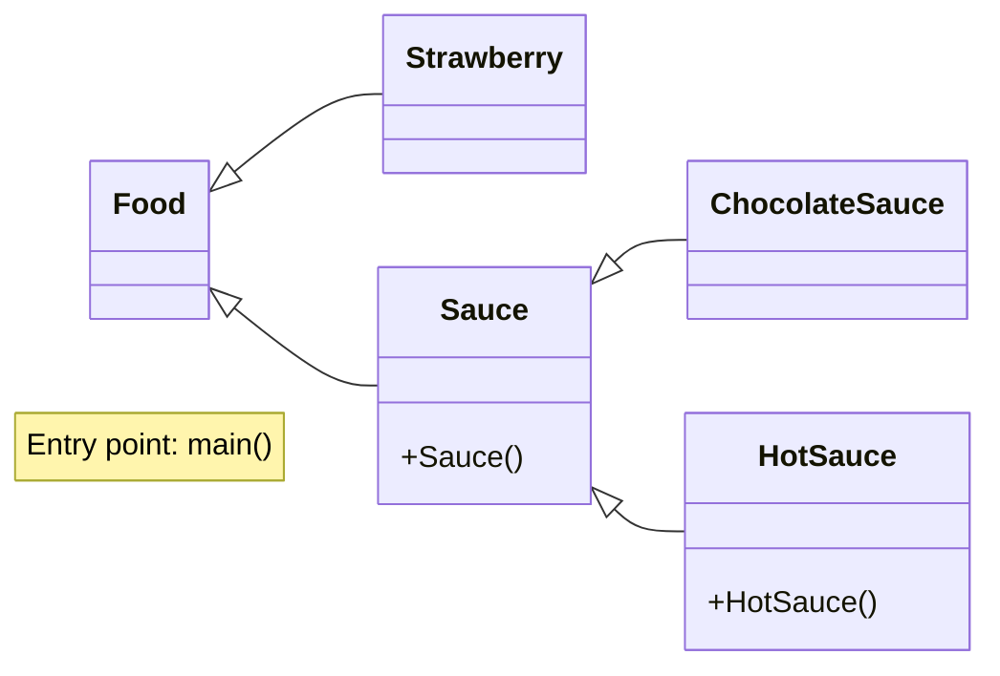

```mermaid
classDiagram
  direction LR

  class Food

  class Strawberry

  class Sauce {
    +Sauce()
  }

  class ChocolateSauce

  class HotSauce {
    +HotSauce()
  }

  Food <|-- Strawberry

  Food <|-- Sauce

  Sauce <|-- ChocolateSauce

  Sauce <|-- HotSauce

  note "Entry point: main()"
```
