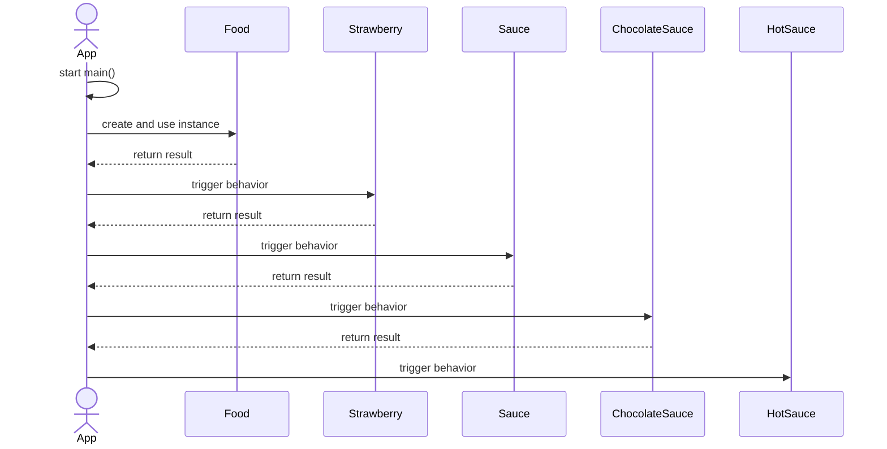

```mermaid
sequenceDiagram
  actor App
  participant Food
  participant Strawberry
  participant Sauce
  participant ChocolateSauce
  participant HotSauce
  App->>App: start main()
  App->>Food: create and use instance
  Food-->>App: return result
  App->>Strawberry: trigger behavior
  Strawberry-->>App: return result
  App->>Sauce: trigger behavior
  Sauce-->>App: return result
  App->>ChocolateSauce: trigger behavior
  ChocolateSauce-->>App: return result
  App->>HotSauce: trigger behavior
```
