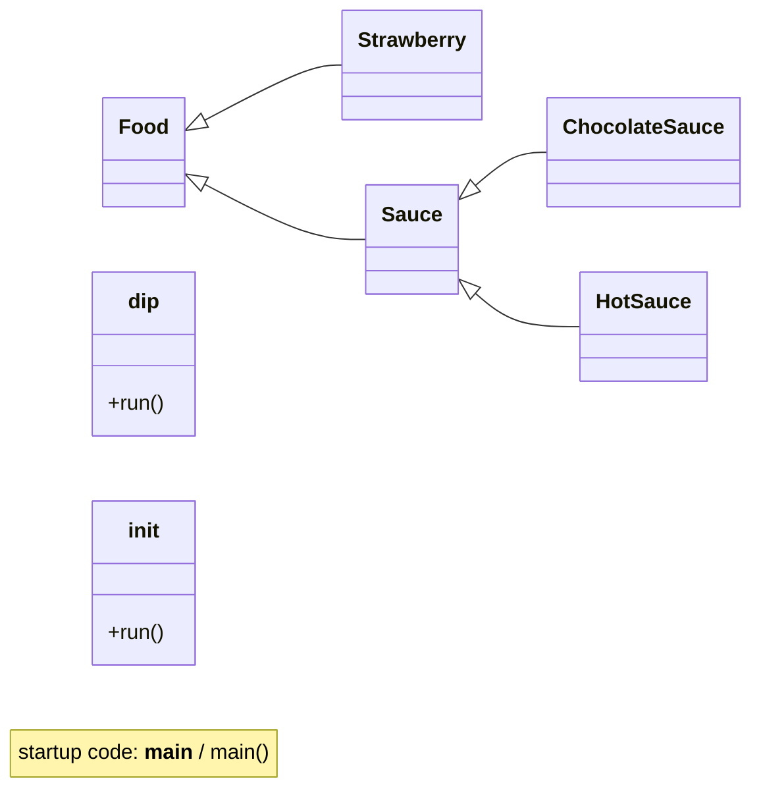

```mermaid
classDiagram
  direction LR
  class Food {
  }
  class Strawberry {
  }
  class Sauce {
  }
  class ChocolateSauce {
  }
  class HotSauce {
  }
  class dip {
    +run()
  }
  class __init__ {
    +run()
  }
  Food <|-- Strawberry
  Food <|-- Sauce
  Sauce <|-- ChocolateSauce
  Sauce <|-- HotSauce
  note "startup code: __main__ / main()"
```
