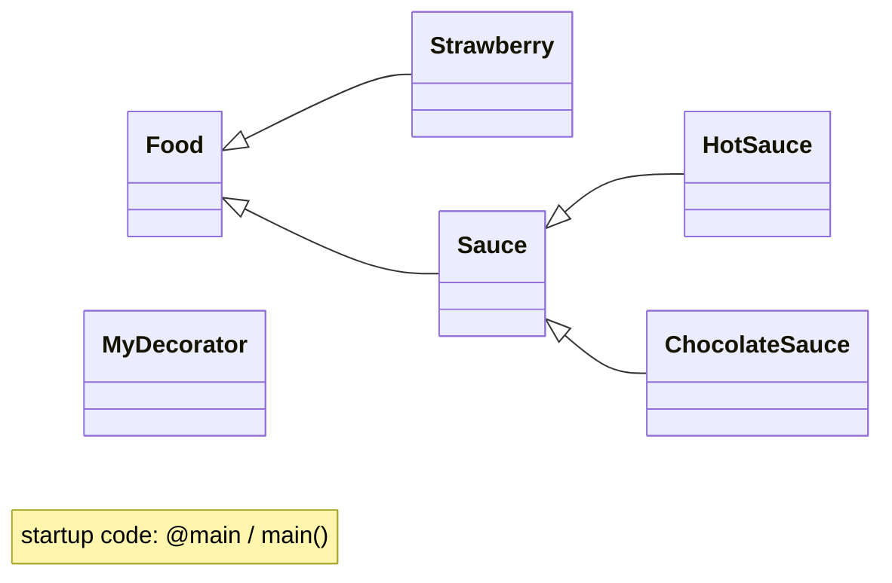

```mermaid
classDiagram
  direction LR
  class Food {
  }
  class Strawberry {
  }
  class Sauce {
  }
  class HotSauce {
  }
  class ChocolateSauce {
  }
  class MyDecorator {
  }
  Food <|-- Strawberry
  Food <|-- Sauce
  Sauce <|-- HotSauce
  Sauce <|-- ChocolateSauce
  note "startup code: @main / main()"
```
