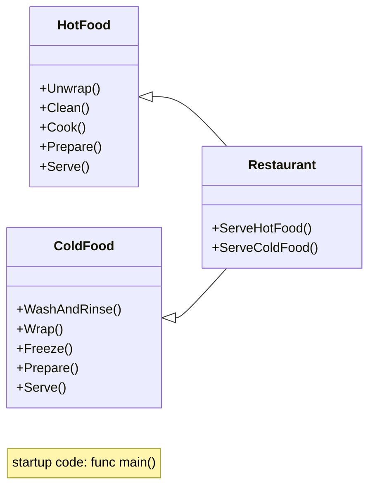

```mermaid
classDiagram
  direction LR
  class Restaurant {
    +ServeHotFood()
    +ServeColdFood()
  }

  class HotFood {
    +Unwrap()
    +Clean()
    +Cook()
    +Prepare()
    +Serve()
  }

  class ColdFood {
    +WashAndRinse()
    +Wrap()
    +Freeze()
    +Prepare()
    +Serve()
  }

  HotFood <|-- Restaurant
  ColdFood <|-- Restaurant
  note "startup code: func main()"
```
