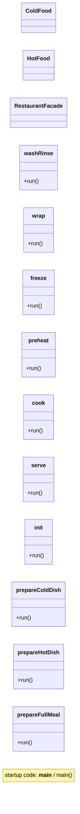

```mermaid
classDiagram
  direction LR
  class ColdFood {
  }
  class HotFood {
  }
  class RestaurantFacade {
  }
  class washRinse {
    +run()
  }
  class wrap {
    +run()
  }
  class freeze {
    +run()
  }
  class preheat {
    +run()
  }
  class cook {
    +run()
  }
  class serve {
    +run()
  }
  class __init__ {
    +run()
  }
  class prepareColdDish {
    +run()
  }
  class prepareHotDish {
    +run()
  }
  class prepareFullMeal {
    +run()
  }
  note "startup code: __main__ / main()"
```
