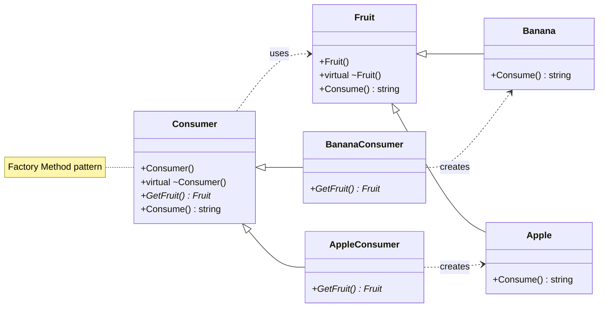

```mermaid
classDiagram
  direction LR

  class Fruit {
    +Fruit()
    +virtual ~Fruit()
    +Consume() string
  }

  class Banana {
    +Consume() string
  }

  class Apple {
    +Consume() string
  }

  class Consumer {
    +Consumer()
    +virtual ~Consumer()
    +GetFruit() Fruit*
    +Consume() string
  }

  class BananaConsumer {
    +GetFruit() Fruit*
  }

  class AppleConsumer {
    +GetFruit() Fruit*
  }

  Fruit <|-- Banana
  Fruit <|-- Apple

  Consumer <|-- BananaConsumer
  Consumer <|-- AppleConsumer

  Consumer ..> Fruit : uses
  BananaConsumer ..> Banana : creates
  AppleConsumer ..> Apple : creates

  note for Consumer "Factory Method pattern"
```
