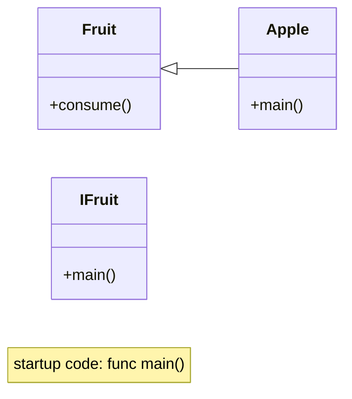

```mermaid
classDiagram
  direction LR
  class Fruit {
    +consume()
  }

  class Apple {
    +main()
  }

  class IFruit {
    +main()
  }

  Fruit <|-- Apple
  note "startup code: func main()"
```
