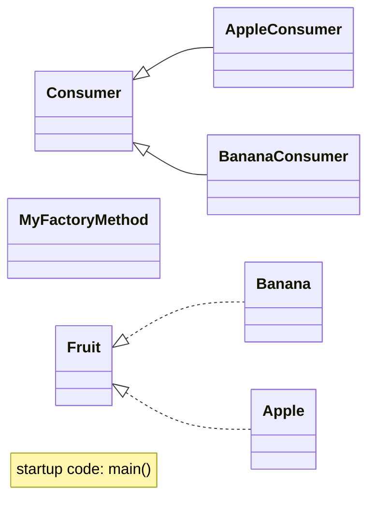

```mermaid
classDiagram
  direction LR
  class AppleConsumer {
  }

  class Consumer {
  }

  class MyFactoryMethod {
  }

  class BananaConsumer {
  }

  class Banana {
  }

  class Fruit {
  }

  class Apple {
  }

  Consumer <|-- AppleConsumer
  Consumer <|-- BananaConsumer
  Fruit <|.. Banana
  Fruit <|.. Apple
  note "startup code: main()"
```
