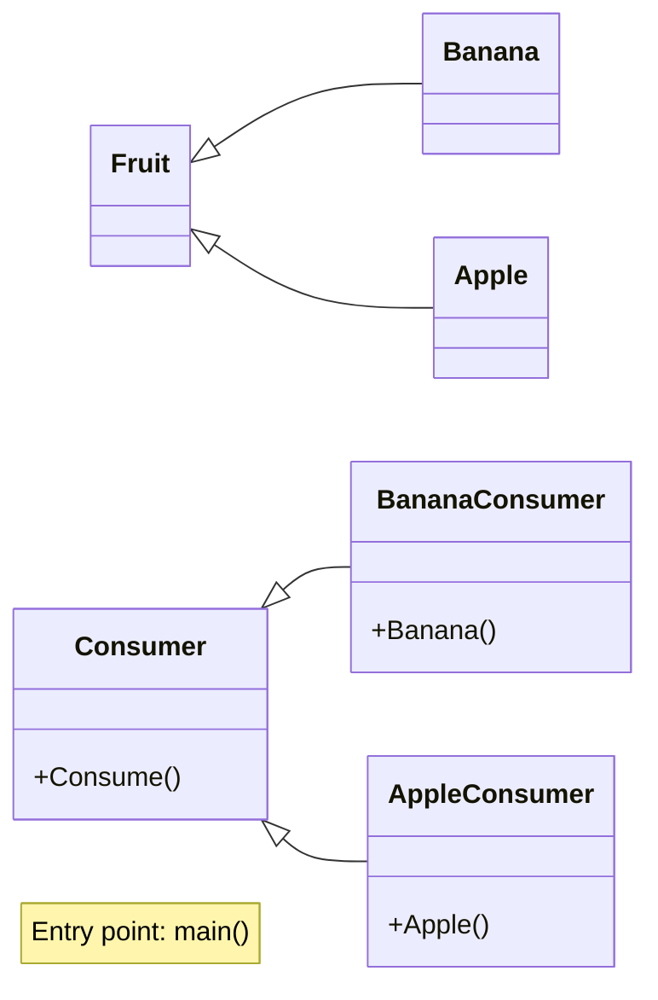

```mermaid
classDiagram
  direction LR

  class Fruit

  class Banana

  class Apple

  class Consumer {
    +Consume()
  }

  class BananaConsumer {
    +Banana()
  }

  class AppleConsumer {
    +Apple()
  }

  Fruit <|-- Banana

  Fruit <|-- Apple

  Consumer <|-- BananaConsumer

  Consumer <|-- AppleConsumer

  note "Entry point: main()"
```
