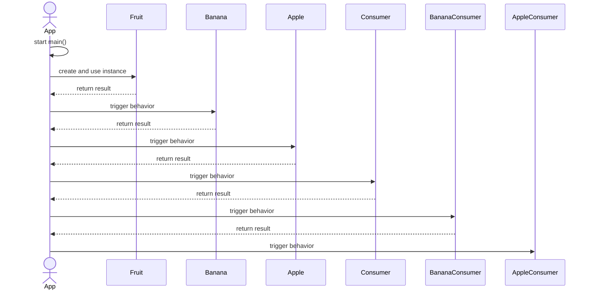

```mermaid
sequenceDiagram
  actor App
  participant Fruit
  participant Banana
  participant Apple
  participant Consumer
  participant BananaConsumer
  participant AppleConsumer
  App->>App: start main()
  App->>Fruit: create and use instance
  Fruit-->>App: return result
  App->>Banana: trigger behavior
  Banana-->>App: return result
  App->>Apple: trigger behavior
  Apple-->>App: return result
  App->>Consumer: trigger behavior
  Consumer-->>App: return result
  App->>BananaConsumer: trigger behavior
  BananaConsumer-->>App: return result
  App->>AppleConsumer: trigger behavior
```
