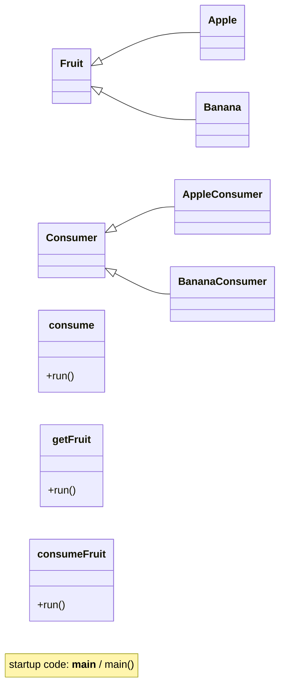

```mermaid
classDiagram
  direction LR
  class Fruit {
  }
  class Apple {
  }
  class Banana {
  }
  class Consumer {
  }
  class AppleConsumer {
  }
  class BananaConsumer {
  }
  class consume {
    +run()
  }
  class getFruit {
    +run()
  }
  class consumeFruit {
    +run()
  }
  Fruit <|-- Apple
  Fruit <|-- Banana
  Consumer <|-- AppleConsumer
  Consumer <|-- BananaConsumer
  note "startup code: __main__ / main()"
```
