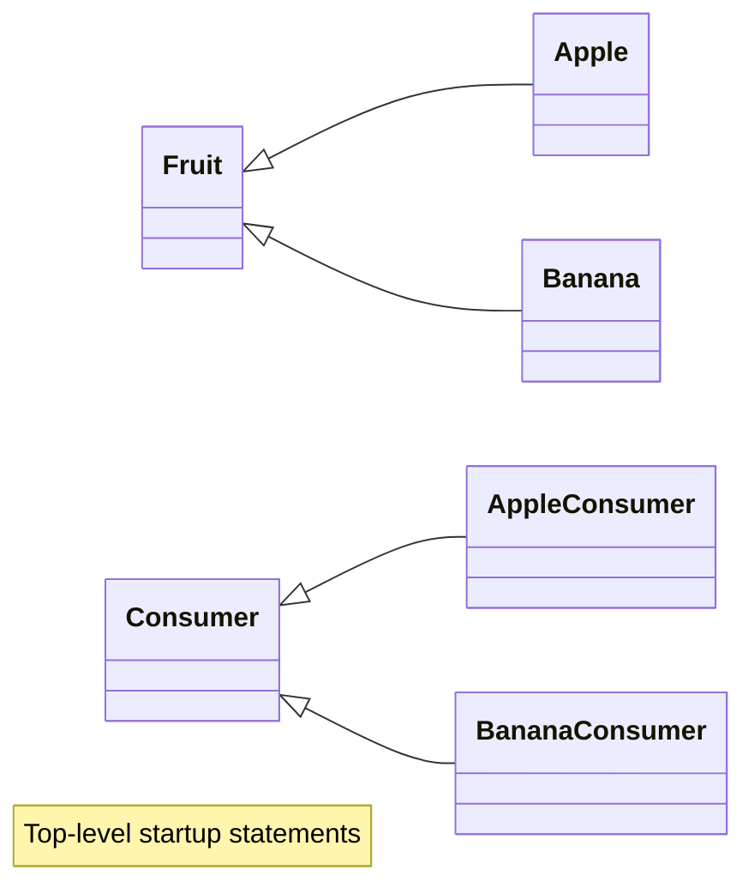

```mermaid
classDiagram
  direction LR
  class Fruit {
  }
  class Apple {
  }
  class Banana {
  }
  class Consumer {
  }
  class AppleConsumer {
  }
  class BananaConsumer {
  }
  Fruit <|-- Apple
  Fruit <|-- Banana
  Consumer <|-- AppleConsumer
  Consumer <|-- BananaConsumer
  note "Top-level startup statements"
```
